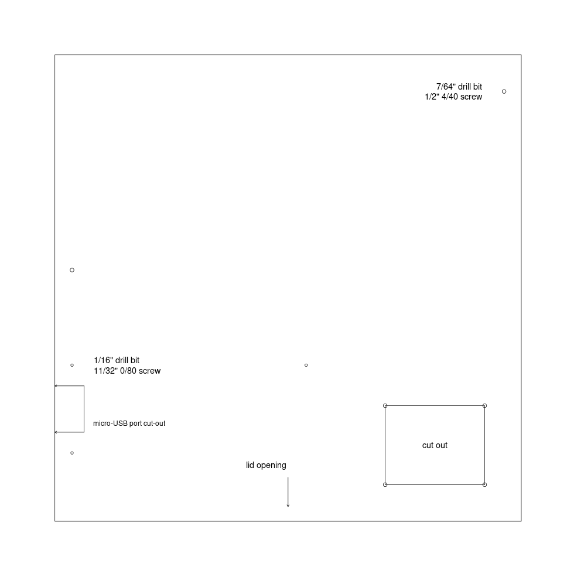

## Drill template

Use R graphics to draw a drill template, to use to define the hole and
cutout placement on the plastic box for the CO2 monitor project.

[`co2_monitor_drill_template.pdf`](co2_monitor_drill_template.pdf)

